# Final Task 1
### Step 1: Create the employees table
  - Define employee_id as a unique integer, auto-increment, and primary key.
  - Define employee_name as a VARCHAR (up to 255 characters), and make it not null.
  - Define manager_id as an integer, which will be a foreign key referencing employee_id from the same table.

### Step 2: Create the departments table
  - Define department_id as a unique integer, auto-increment, and primary key.
  - Define department_name as a VARCHAR (up to 255 characters), and make it not null.

### Step 3: Create the employee_departments table
  - Define employee_id as an integer, which will be a foreign key referencing employee_id in the employees table.
  - Define department_id as an integer, which will be a foreign key referencing department_id in the departments table.
  - Set a composite primary key on the combination of employee_id and department_id.

### Step 4: Create the employee_projects table
  - Define employee_id as an integer, which will be a foreign key referencing employee_id in the employees table.
  - Define project_name as a VARCHAR (up to 255 characters), and make it not null.

### Step 5: Create the managers table
  - Define manager_id as a unique integer, auto-increment, and primary key.
  - Define employee_id as an integer, which will be a foreign key referencing employee_id in the employees table.
 

## Screenshots
#### Employees Table
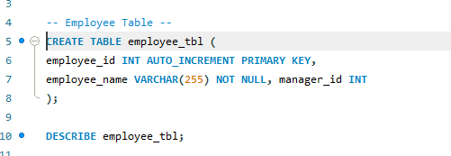

#### Department Table
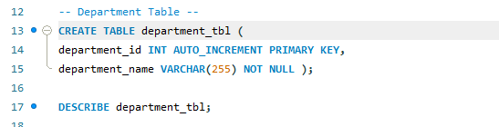

#### Employee & Department Table
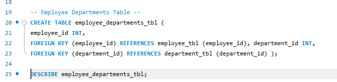

#### Employees Project
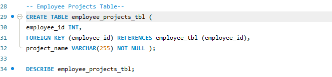

#### Manager Table
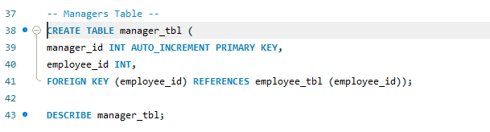

#### Employees Table
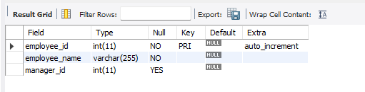

#### Department Table
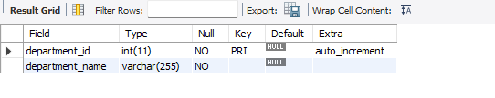

#### Employee & Department Table
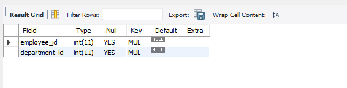

#### Employees Project
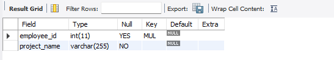

#### Manager Table
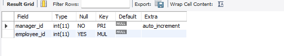

### ER Diagram
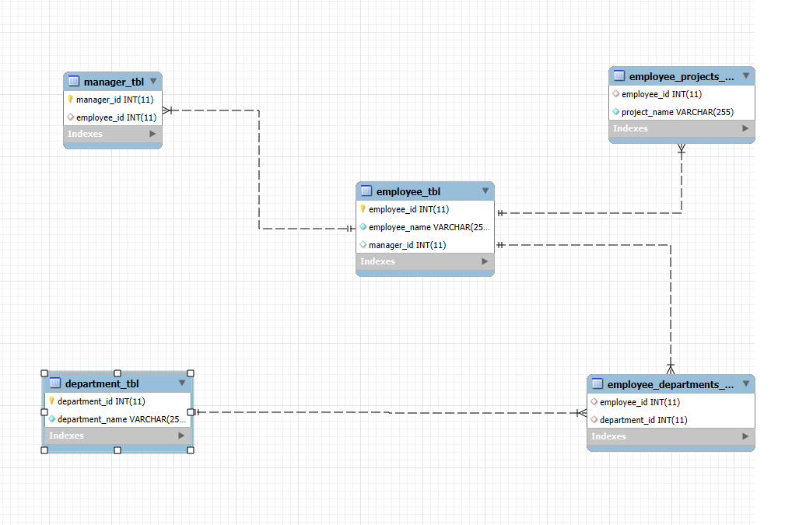
